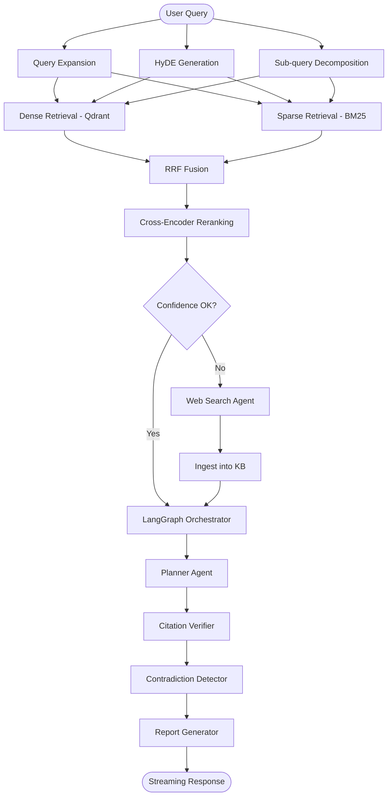
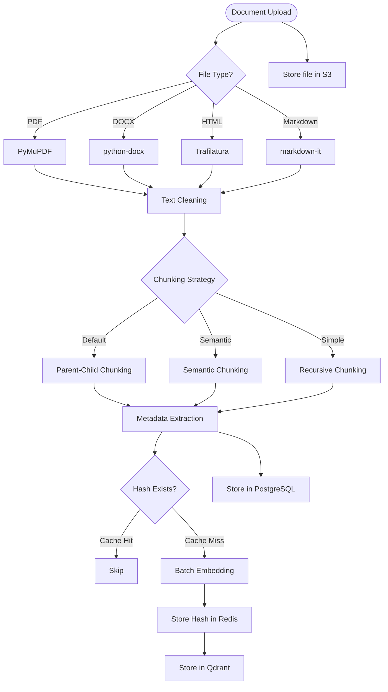
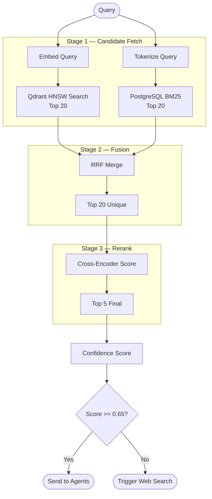
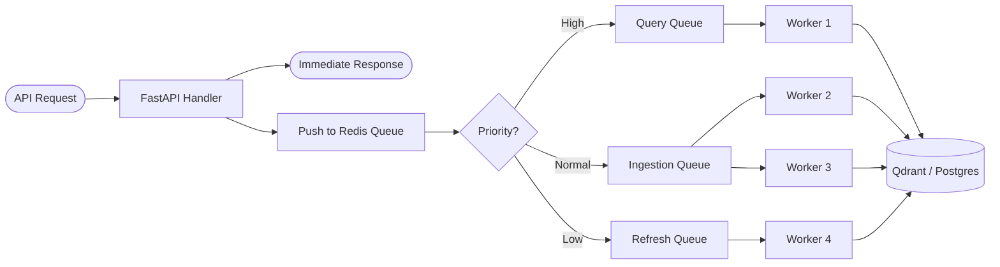
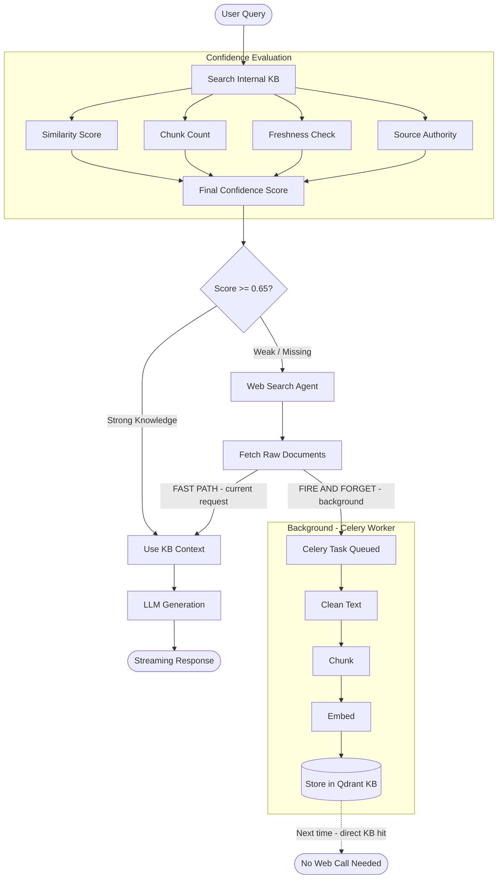
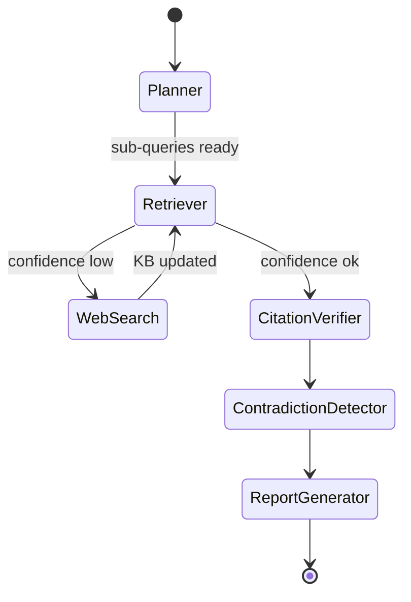

# ResearchOS — Flow Diagrams

---

## 1. Main System Flow

---

## 2. Document Ingestion Pipeline

---

## 3. Retrieval Pipeline

---

## 4. Async Task Queue

---

## 5. Adaptive KB — Self-Improving RAG

> Web se jo raw content aaya wo seedha LLM ko milta hai current response ke liye.
> Ingestion background mein hota hai — current request block nahi hoti.

---

## 6. LangGraph Agent States

